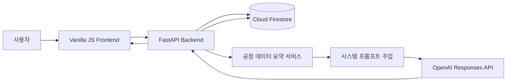
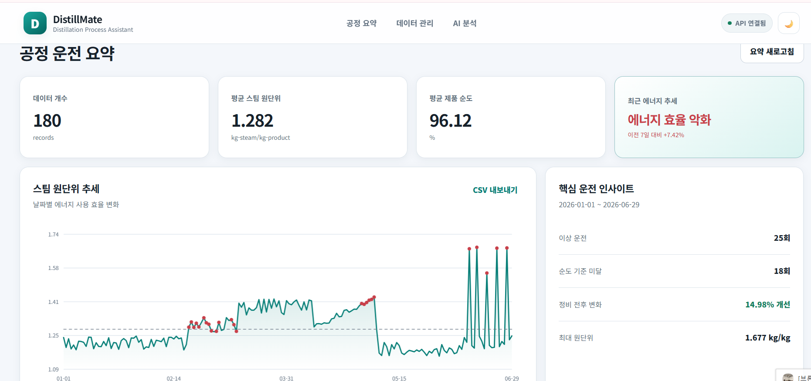
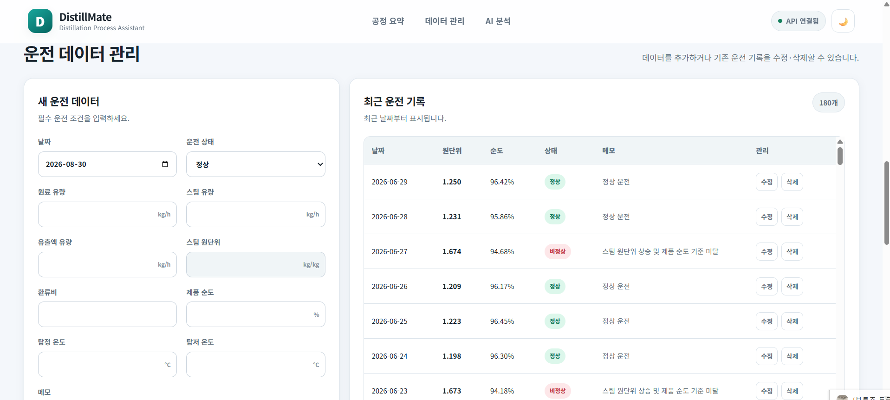
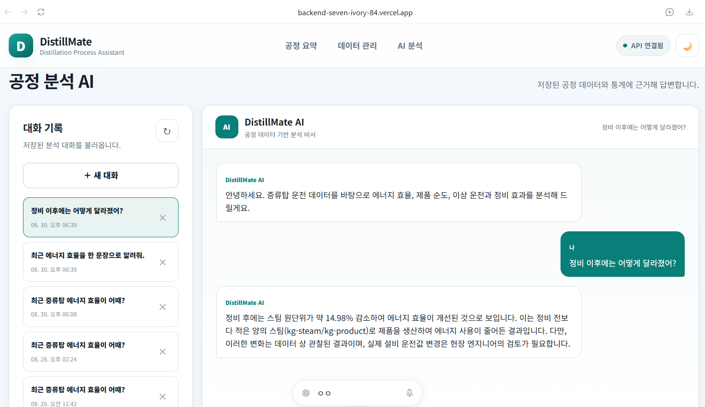

# DistillMate

증류탑 에너지·품질 운전 데이터를 분석하고, 사용자의 공정 데이터를 바탕으로 맞춤형 답변을 제공하는 AI 공정 분석 비서입니다.

## 1. 서비스 소개

일반적인 AI 챗봇은 사용자의 실제 공정 데이터를 알지 못하기 때문에 구체적인 운전 상태를 설명하기 어렵습니다.

DistillMate는 Firestore에 저장된 증류탑 시계열 데이터를 분석해 요약 정보를 생성하고, 이 요약을 OpenAI 시스템 프롬프트에 주입합니다.

사용자는 자연어 질문을 통해 다음 내용을 확인할 수 있습니다.

- 최근 스팀 원단위 변화
- 증류탑 에너지 효율 추세
- 제품 순도 기준 미달
- 이상 운전 발생 시점
- 정비 전후 에너지 효율 변화

> 본 프로젝트의 데이터는 포트폴리오 및 교육 목적으로 생성한 합성 데이터입니다. 실제 설비 운전값 변경에는 현장 엔지니어의 검토가 필요합니다.

## 2. 주요 기능

### 데이터 기반 AI 채팅

- 저장된 공정 데이터 요약을 시스템 프롬프트에 주입
- 증류탑 에너지 효율과 품질에 대한 맞춤형 답변
- AI 응답 대기 중 로딩 표시
- 기존 대화의 문맥을 활용한 후속 질문

### 운전 데이터 관리

- 운전 데이터 추가·조회·수정·삭제
- 스팀 원단위 자동 계산

### 공정 데이터 분석

- 데이터 기간 및 개수
- 평균·최대·최소 스팀 원단위
- 평균 제품 순도와 기준 미달 횟수
- 최근 7일과 이전 7일 비교
- 이상 운전 날짜
- 정비 전후 스팀 원단위 변화

### 대화 기록

- AI 채팅 자동 저장
- 대화 목록 조회 및 특정 대화 불러오기
- 대화 삭제

### 추가 기능

- 스팀 원단위 추세 그래프
- CSV 데이터 내보내기
- 다크 모드
- 반응형 화면

## 3. 데이터 설명

총 180일의 증류탑 운전 시계열 데이터를 사용합니다.

- 기간: 2026-01-01 ~ 2026-06-29
- 데이터 개수: 180개
- 핵심 지표: 스팀 원단위
- 계산식: `스팀 원단위 = 스팀 유량 / 유출액 유량`

현재 데이터 분석 결과:

- 평균 스팀 원단위: 1.282 kg-steam/kg-product
- 평균 제품 순도: 96.12%
- 제품 순도 기준 미달: 18회
- 최근 원단위 변화율: +7.42%
- 최근 에너지 효율 상태: 악화
- 정비 전후 원단위 변화율: -14.98%

## 4. 기술 스택

### Backend

- Python 3.12
- FastAPI, Uvicorn, Pydantic
- Firebase Admin SDK, Cloud Firestore
- OpenAI Responses API

### Frontend

- HTML, CSS, Vanilla JavaScript
- Canvas API

### Deployment

- Backend: Render
- Frontend: Vercel
- Database: Firebase Firestore

## 5. 시스템 구조



## 6. AI 컨텍스트 주입 흐름

1. 사용자가 공정 관련 질문을 입력합니다.
2. FastAPI가 Firestore의 운전 데이터를 조회합니다.
3. 평균, 최대, 최소, 최근 추세와 이상 운전을 계산합니다.
4. 계산된 데이터 요약을 시스템 프롬프트에 삽입합니다.
5. 사용자 질문과 기존 대화 내용을 OpenAI API에 전달합니다.
6. AI 답변을 사용자에게 반환합니다.
7. 질문과 답변을 Firestore의 `conversations` 컬렉션에 저장합니다.

이 방식을 통해 AI가 일반적인 답변이 아니라 실제 저장 데이터에 근거한 답변을 생성합니다.

## 7. Firestore 구조

### data 컬렉션

```text
data/{document_id}
├─ date
├─ value
├─ memo
├─ feed_flow_kg_h
├─ steam_flow_kg_h
├─ distillate_flow_kg_h
├─ reflux_ratio
├─ product_purity_pct
├─ top_temperature_c
├─ bottom_temperature_c
└─ operating_status
```

### conversations 컬렉션

```text
conversations/{conversation_id}
├─ title
├─ messages
│  ├─ role
│  ├─ content
│  └─ timestamp
├─ created_at
└─ updated_at
```

## 8. API 목록

| Method | Endpoint | 설명 |
|---|---|---|
| GET | `/health` | 서버 상태 확인 |
| POST | `/api/data` | 데이터 추가 |
| GET | `/api/data` | 데이터 목록 조회 |
| PUT | `/api/data/{id}` | 데이터 수정 |
| DELETE | `/api/data/{id}` | 데이터 삭제 |
| GET | `/api/data/summary` | 공정 데이터 요약 |
| POST | `/api/chat` | 데이터 기반 AI 채팅 |
| POST | `/api/conversations` | 대화 저장 |
| GET | `/api/conversations` | 대화 목록 조회 |
| GET | `/api/conversations/{id}` | 특정 대화 불러오기 |
| DELETE | `/api/conversations/{id}` | 대화 삭제 |

## 9. 배포 URL

- 프론트엔드: https://backend-seven-ivory-84.vercel.app
- 백엔드 API: https://distillmate-api.onrender.com
- Swagger UI: https://distillmate-api.onrender.com/docs

## 10. 로컬 실행 방법

### 저장소 내려받기

```powershell
git clone https://github.com/zzangminju/distillmate.git
cd distillmate
```

### 가상환경 생성 및 실행

```powershell
python -m venv .venv
.\.venv\Scripts\Activate.ps1
```

### 패키지 설치

```powershell
python -m pip install -r .\backend\requirements.txt
```

### 환경변수 설정

프로젝트 최상위의 `.env.example`을 복사해 `.env`를 생성합니다.

```powershell
Copy-Item .env.example .env
```

로컬 Firebase 서비스 계정 키 파일을 프로젝트 최상위에 `firebase-service-account.json`이라는 이름으로 저장합니다.

### 백엔드 실행

```powershell
python -m uvicorn backend.app.main:app --reload --port 8000
```

- API: http://127.0.0.1:8000
- Swagger: http://127.0.0.1:8000/docs

### 프론트엔드 실행

새 터미널에서 실행합니다.

```powershell
python -m http.server 5500 --directory frontend
```

- Frontend: http://127.0.0.1:5500

## 11. 환경변수

| 변수 | 사용 환경 | 설명 |
|---|---|---|
| `OPENAI_API_KEY` | Backend | OpenAI API 키 |
| `OPENAI_MODEL` | Backend | 사용할 OpenAI 모델 |
| `FIREBASE_SERVICE_ACCOUNT_PATH` | Local | Firebase 키 파일 경로 |
| `FIREBASE_SERVICE_ACCOUNT_JSON` | Render | Firebase 서비스 계정 JSON 문자열 |
| `ALLOWED_ORIGINS` | Backend | CORS 허용 프론트 주소 |
| `API_BASE_URL` | Vercel | Render 백엔드 API 주소 |

API 키와 Firebase 서비스 계정 키는 GitHub에 업로드하지 않습니다.

## 12. 배포 시 주의사항

Render 무료 인스턴스는 일정 시간 사용하지 않으면 중지될 수 있어 첫 요청이 지연될 수 있습니다.

프론트 화면에 API 연결 상태를 표시하고 있으며, 서버가 준비되는 동안 잠시 기다린 후 다시 시도할 수 있습니다.

배포 후 Render의 `ALLOWED_ORIGINS`에 실제 Vercel 주소를 등록해야 합니다.

## 13. 라우터와 서비스의 책임 분리

FastAPI 라우터는 HTTP 요청·응답과 상태 코드에 집중하고, 서비스는 공정 계산·Firestore 접근·AI 호출을 담당합니다. 이 기준으로 분리하면 특정 계산이나 저장 방식을 변경해도 API 주소와 요청 형식에 미치는 영향을 줄일 수 있습니다.

| 구성 요소 | 책임 | 분리한 이유 |
|---|---|---|
| `routers/data.py` | 데이터 CRUD와 요약 API의 요청·응답 처리 | HTTP 처리와 공정 계산 로직 분리 |
| `routers/conversations.py` | 대화 저장·조회·삭제 및 404 처리 | 대화 관련 API 계약을 한곳에서 관리 |
| `routers/chat.py` | AI 채팅 요청과 OpenAI 오류의 HTTP 변환 | 외부 API 오류를 일관된 사용자 메시지로 변환 |
| `services/data_service.py` | Firestore `data` 컬렉션 CRUD | DB 접근 코드를 라우터와 분리해 재사용 |
| `services/summary_service.py` | 통계, 추세, 이상 운전, 정비 효과 계산 | 대시보드와 AI 프롬프트에서 같은 결과 사용 |
| `services/conversation_service.py` | 대화 생성·정렬·메시지 추가·삭제 | 대화 저장 형식과 시간 갱신 규칙 통합 |
| `services/chat_service.py` | 컨텍스트 생성, OpenAI 호출, 대화 자동 저장 | AI 처리 순서를 HTTP 코드와 분리 |

## 14. Firestore 컬렉션 설계 이유

### `data` 컬렉션

한 날짜의 운전 조건을 하나의 문서로 저장했습니다.

- 문서 ID를 이용해 특정 기록을 바로 수정·삭제할 수 있습니다.
- `date`를 독립 필드로 두어 시간순 정렬과 향후 기간 쿼리에 사용할 수 있습니다.
- 유량·온도·순도·상태를 한 문서에 두어 AI 요약에 필요한 값을 한 번에 읽습니다.
- 계산된 스팀 원단위 `value`와 원본 유량을 함께 저장합니다. 화면과 통계에서는 `value`를 바로 사용하고, 원본 유량으로 계산값을 재검증할 수 있습니다.
- 현재는 단일 증류탑의 일별 시계열이므로 불필요한 하위 컬렉션으로 과도하게 정규화하지 않았습니다.

### `conversations` 컬렉션

하나의 대화와 메시지 배열을 하나의 문서로 저장했습니다.

- 대화를 선택할 때 한 번의 문서 조회로 전체 메시지를 불러올 수 있습니다.
- `updated_at`을 기준으로 최근 대화를 먼저 정렬할 수 있습니다.
- `role`, `content`, `timestamp`를 저장해 사용자와 AI의 대화 순서를 그대로 재현합니다.
- 교육용 서비스의 짧은 대화에서는 메시지 배열 방식이 구현과 조회에 단순합니다.

메시지가 매우 많아지면 Firestore 문서 크기와 동시 수정 충돌을 고려해 `conversations/{id}/messages/{message_id}` 하위 컬렉션으로 분리할 수 있습니다.

## 15. Pydantic 스키마와 검증 목적

Pydantic은 잘못된 값이 서비스와 Firestore에 전달되기 전에 요청을 거부하고, API의 요청·응답 형태를 Swagger에 명확히 표시하기 위해 사용합니다.

| 스키마 | 역할 | 주요 검증 |
|---|---|---|
| `DataCreate` | 신규 운전 데이터 요청 | 유량·환류비·원단위는 0보다 큰 값 |
| `DataUpdate` | 운전 데이터 수정 요청 | 생성 요청과 동일한 공정 범위 검증 |
| `DataResponse` | 운전 데이터 응답 | 검증된 필드와 Firestore 문서 ID 반환 |
| `ChatRequest` | AI 질문 요청 | 질문 1~1000자, 선택적 `conversation_id` |
| `ChatResponse` | AI 답변 응답 | `answer`, `conversation_id` 형태 고정 |
| `Message` | 대화 메시지 | 역할은 `user` 또는 `assistant`, 내용 1~5000자 |
| `ConversationCreate` | 대화 저장 요청 | 제목 1~100자와 메시지 목록 검증 |

`DataBase`의 교차 필드 검증은 아래 계산을 다시 수행합니다.

```text
value ≒ steam_flow_kg_h / distillate_flow_kg_h
```

두 값의 차이가 `0.02`를 넘으면 저장을 거부합니다. 또한 제품 순도는 `0~100%`, 메모는 `1~500자`, 운전 상태는 정의된 Enum 값만 허용합니다.

## 16. 요약 API 분리 이유와 분석 기준

`GET /api/data/summary`는 CRUD와 다른 책임을 가진 분석 전용 엔드포인트입니다.

- 프론트 대시보드가 AI 호출 없이 요약만 독립적으로 조회할 수 있습니다.
- `chat_service.py`가 동일한 `get_data_summary()`를 시스템 프롬프트 생성에 재사용합니다.
- 요약 계산을 수정해도 데이터 저장 API의 계약은 바뀌지 않습니다.
- 향후 요약 결과를 캐시하거나 배치 계산으로 전환하기 쉽습니다.

요약 기준은 `backend/app/services/summary_service.py`에서 변경합니다.

| 기준 | 현재 구현 | 변경 위치 |
|---|---|---|
| 제품 순도 기준 | `PRODUCT_PURITY_SPEC = 95.0` | 상수 수정 |
| 최근 비교 기간 | `records[-7:]` | 최근 N일에 맞게 수정 |
| 이전 비교 기간 | `records[-14:-7]` | 최근 기간과 같은 크기로 수정 |
| 추세 판정 | +3% 이상 악화, -3% 이하 개선 | `trend_change` 조건문 |
| 이상 운전 | 평균 + 표준편차 2배 초과 또는 `ABNORMAL` | `anomaly_threshold` 조건 |
| 정비 효과 | 첫 정비 시점 전후 각 14개 기록 | 전후 슬라이스 범위 |

최근 30일과 이전 30일을 비교하려면 다음처럼 변경할 수 있습니다.

```python
recent_records = records[-30:]
previous_records = records[-60:-30]
```

현재는 180개 문서를 모두 읽어 Python에서 요약합니다. 데이터가 수만 건으로 증가하면 날짜 범위 쿼리, 페이지네이션, 최근 구간 조회, 일·주·월 집계 문서, 배치 작업 기반 요약 캐시가 필요합니다.

### 요약 API 응답 예시

```json
{
  "period": "2026-01-01 ~ 2026-06-29",
  "count": 180,
  "metrics": {
    "average_steam_intensity": 1.282,
    "max_steam_intensity": 1.677,
    "min_steam_intensity": 1.152,
    "average_product_purity": 96.12,
    "off_spec_count": 18
  },
  "trend": {
    "recent_7days_average": 1.351,
    "previous_7days_average": 1.258,
    "change_percent": 7.42,
    "status": "에너지 효율 악화"
  },
  "anomaly_count": 25,
  "maintenance_effect": {
    "before_average": 1.392,
    "after_average": 1.183,
    "change_percent": -14.98
  }
}
```

## 17. 컨텍스트 주입의 장점과 한계

서버가 먼저 결정적인 통계를 계산한 뒤 요약 결과와 최근 운전 기록을 시스템 프롬프트에 삽입합니다. AI에게 모든 산술 계산을 맡기지 않기 때문에 동일 데이터에 대한 수치의 일관성을 높일 수 있습니다.

### 장점

- 실제 저장된 공정 수치에 근거한 맞춤형 답변을 제공합니다.
- 서버가 계산한 통계를 사용해 AI의 산술 오류 가능성을 줄입니다.
- 단위와 답변 규칙을 프롬프트에 포함해 출력 형식을 통제합니다.
- 데이터가 변경되면 다음 질문부터 최신 요약을 반영합니다.

### 단점과 리스크

- 질문마다 데이터 조회와 계산이 발생해 응답 시간과 비용이 증가할 수 있습니다.
- 잘못된 센서값이나 메모가 저장되면 AI 답변의 근거도 잘못될 수 있습니다.
- 프롬프트가 길어지면 토큰 비용이 증가합니다.
- AI 답변은 확률적이므로 같은 질문의 표현이 달라질 수 있습니다.
- 관찰된 상관관계를 실제 공정 원인으로 단정할 위험이 있습니다.

프롬프트에는 데이터에 없는 원인을 단정하지 않고, 관찰과 확정 원인을 구분하며, 실제 운전값 변경에는 현장 엔지니어 검토가 필요하다는 규칙을 포함했습니다. 출력 토큰도 500으로 제한했습니다.

## 18. 프론트엔드 상태관리 흐름

프레임워크 없이 `frontend/app.js`의 단일 상태 객체를 사용합니다.

```javascript
const state = {
  records: [],
  summary: null,
  conversations: [],
  currentConversationId: null,
};
```

| 상태 | 갱신 시점 | 사용하는 기능 |
|---|---|---|
| `records` | 시작 시, CRUD 완료 후 `loadData()` | 데이터 표, 수정 폼, 그래프, CSV |
| `summary` | 시작 시, CRUD 완료 후 `loadSummary()` | 요약 카드, 인사이트, 평균 기준선 |
| `conversations` | 시작 시, 채팅 저장·삭제·새로고침 후 | 대화 목록 |
| `currentConversationId` | 새 대화, 대화 불러오기, 채팅 응답 후 | 후속 질문 연결과 선택 상태 |

앱 시작 시 `Promise.allSettled()`로 데이터, 요약, 대화 목록을 함께 불러옵니다. CRUD 완료 후에는 `loadData()`와 `loadSummary()`를 동시에 실행해 목록과 통계가 서로 다른 상태가 되지 않도록 합니다. 화면 크기가 바뀌면 150ms 디바운스 후 Canvas 그래프를 다시 그립니다.

## 19. 대화 저장 시점과 실패 처리

대화 저장은 OpenAI 답변이 성공적으로 생성된 직후 동기적으로 수행합니다.

- 새 대화는 질문과 답변으로 새 Firestore 문서를 생성합니다.
- 기존 대화는 메시지를 추가하고 `updated_at`을 갱신합니다.
- 저장 성공 후에만 `conversation_id`를 포함한 최종 응답을 반환합니다.
- 존재하지 않는 대화는 `404`, OpenAI 연결 실패는 `502`, 시간 초과는 `504`로 처리합니다.
- 프론트는 실패 메시지를 채팅과 토스트에 표시하고 로딩 상태를 해제합니다.

현재 OpenAI 호출과 Firestore 저장을 하나의 분산 트랜잭션으로 묶거나 자동 롤백하지 않습니다. OpenAI 답변 후 저장이 실패하면 사용자가 다시 시도해야 합니다. 운영 규모가 커지면 요청 ID 또는 멱등성 키로 중복 저장을 방지할 수 있습니다.

## 20. 입력 검증과 출력 보안 정책

### 허용 입력

- 날짜: ISO 날짜 형식
- 유량·환류비·원단위: 0보다 큰 숫자
- 제품 순도: 0~100 범위
- 운전 상태: `NORMAL`, `PARTIAL_LOAD`, `MAINTENANCE`, `ABNORMAL`
- 메모: 1~500자
- AI 질문: 1~1000자
- 대화 제목: 1~100자
- 메시지: 1~5000자

### 차단 및 안전 처리

- 잘못된 자료형·범위·Enum 값은 Pydantic이 `422`로 거부합니다.
- 원단위 계산이 허용 오차를 벗어나면 저장하지 않습니다.
- 채팅 메시지는 `textContent`로 출력합니다.
- HTML 템플릿에 들어가는 대화 제목과 ID는 `escapeHtml()`로 이스케이프합니다.
- 사용자 입력 HTML이나 JavaScript를 코드로 실행하지 않습니다.
- 키와 서비스 계정 정보는 서버 환경 변수로만 관리합니다.

현재 욕설이나 주제 키워드를 차단하는 내용 기반 필터는 적용하지 않았습니다. 대신 길이, 자료형, 숫자 범위, Enum, 교차 필드 계산을 검증하고 출력 시 HTML을 이스케이프합니다.

## 21. 배포 환경 변수와 운영 예시

### Render

```text
OPENAI_API_KEY=<OpenAI API 키 한 개만 입력>
OPENAI_MODEL=gpt-4.1-mini
FIREBASE_SERVICE_ACCOUNT_JSON=<서비스 계정 JSON 전체>
ALLOWED_ORIGINS=http://localhost:5500,http://127.0.0.1:5500,https://backend-seven-ivory-84.vercel.app
PYTHON_VERSION=3.12.7
```

각 변수는 Render의 별도 입력란에 저장합니다. `OPENAI_API_KEY` 값에 다른 환경 변수를 줄바꿈으로 함께 넣으면 인증 헤더가 깨지므로 반드시 분리합니다.

### Vercel

```text
API_BASE_URL=https://distillmate-api.onrender.com
```

브라우저는 Vercel과 Render를 서로 다른 출처로 판단하므로 `ALLOWED_ORIGINS`에 실제 프론트 주소를 등록해야 합니다. 임의의 전체 허용값 `*` 대신 로컬 개발 주소와 실제 배포 도메인만 허용합니다.

Render 무료 서버가 잠들어 있을 때 사용자에게 권장하는 안내는 다음과 같습니다.

> 무료 서버가 준비되는 중입니다. 첫 접속은 최대 1분 정도 걸릴 수 있습니다. 잠시 기다린 후 새로고침해 주세요.

API 키와 서비스 계정 키가 코드, README, 로그에 노출되면 즉시 기존 키를 폐기하고 새 키로 교체합니다.

## 22. 검증 시나리오

### 배포 API

```powershell
Invoke-RestMethod -Uri "https://distillmate-api.onrender.com/health"
Invoke-RestMethod -Uri "https://distillmate-api.onrender.com/api/data/summary"
```

Swagger의 `Try it out`에서 요청 스키마, 상태 코드, 실제 JSON 응답을 확인할 수 있습니다.

### 데이터 CRUD

1. 새 운전 데이터를 입력합니다.
2. 저장 성공 안내와 목록 갱신을 확인합니다.
3. 수정 버튼으로 기존 값이 입력 폼에 표시되는지 확인합니다.
4. 수정·삭제 후 목록과 요약 카드가 함께 갱신되는지 확인합니다.

### AI 채팅과 대화 저장

1. “최근 증류탑 에너지 효율은 어때?”라고 질문합니다.
2. 로딩 표시와 입력 비활성화를 확인합니다.
3. 최근 7일 평균, 이전 7일 평균, 변화율이 포함된 답변을 확인합니다.
4. 대화 목록에 새 대화가 생성되는지 확인합니다.
5. 대화를 선택했을 때 전체 질문과 답변이 다시 표시되는지 확인합니다.

### 모바일·반응형

1. 브라우저 개발자 도구에서 모바일 화면 크기로 변경합니다.
2. 요약 카드, 입력 폼, 대화 목록이 화면 폭에 맞게 배치되는지 확인합니다.
3. 화면 크기 변경 후 그래프가 다시 그려지는지 확인합니다.
4. 터치 환경에서 저장·수정·삭제·채팅 버튼을 사용할 수 있는지 확인합니다.

## 23. 현재 한계와 개선 방향

- 대규모 데이터에서는 날짜 쿼리와 요약 캐시가 필요합니다.
- 장기 대화는 메시지 하위 컬렉션으로 분리할 필요가 있습니다.
- OpenAI와 Firestore 사이의 분산 트랜잭션과 자동 롤백은 구현하지 않았습니다.
- 사용자 인증이 없어 현재는 단일 사용자 포트폴리오 서비스입니다.
- 실제 공정 적용 전 센서 이상치, 결측치, 단위 일관성을 추가 검증해야 합니다.
- AI 답변 품질을 정량 평가하는 테스트 데이터셋과 회귀 테스트를 추가할 수 있습니다.

## 24. 제출 스크린샷

### 공정 운전 요약

180일 운전 데이터의 평균 스팀 원단위, 평균 제품 순도, 최근 에너지 추세, 이상 운전 및 정비 효과를 시각화합니다.



### 데이터 관리

운전 데이터 입력 폼과 최근 운전 기록을 제공하며, 데이터 추가·조회·수정·삭제 기능을 지원합니다.



### AI 채팅 및 대화 기록 불러오기

저장된 공정 데이터 요약을 기반으로 AI가 답변하며, 이전 대화 목록을 조회하고 다시 불러올 수 있습니다.


