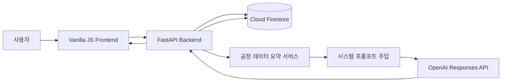

# DistillMate

증류탑 에너지·품질 운전 데이터를 분석하고, 사용자의 공정 데이터를 바탕으로 맞춤형 답변을 제공하는 AI 공정 분석 비서입니다.

## 1. 서비스 소개

일반적인 AI 챗봇은 사용자의 실제 공정 데이터를 알지 못하기 때문에 구체적인 운전 상태를 설명하기 어렵습니다.

DistillMate는 Firestore에 저장된 증류탑 시계열 데이터를 분석해 요약 정보를 생성하고, 이 요약을 OpenAI 시스템 프롬프트에 주입합니다.

사용자는 자연어 질문을 통해 다음 내용을 확인할 수 있습니다.

- 최근 스팀 원단위 변화
- 증류탑 에너지 효율 추세
- 제품 순도 기준 미달
- 이상 운전 발생 시점
- 정비 전후 에너지 효율 변화

> 본 프로젝트의 데이터는 포트폴리오 및 교육 목적으로 생성한 합성 데이터입니다. 실제 설비 운전값 변경에는 현장 엔지니어의 검토가 필요합니다.

## 2. 주요 기능

### 데이터 기반 AI 채팅

- 저장된 공정 데이터 요약을 시스템 프롬프트에 주입
- 증류탑 에너지 효율과 품질에 대한 맞춤형 답변
- AI 응답 대기 중 로딩 표시
- 기존 대화의 문맥을 활용한 후속 질문

### 운전 데이터 관리

- 운전 데이터 추가·조회·수정·삭제
- 스팀 원단위 자동 계산

### 공정 데이터 분석

- 데이터 기간 및 개수
- 평균·최대·최소 스팀 원단위
- 평균 제품 순도와 기준 미달 횟수
- 최근 7일과 이전 7일 비교
- 이상 운전 날짜
- 정비 전후 스팀 원단위 변화

### 대화 기록

- AI 채팅 자동 저장
- 대화 목록 조회 및 특정 대화 불러오기
- 대화 삭제

### 추가 기능

- 스팀 원단위 추세 그래프
- CSV 데이터 내보내기
- 다크 모드
- 반응형 화면

## 3. 데이터 설명

총 180일의 증류탑 운전 시계열 데이터를 사용합니다.

- 기간: 2026-01-01 ~ 2026-06-29
- 데이터 개수: 180개
- 핵심 지표: 스팀 원단위
- 계산식: `스팀 원단위 = 스팀 유량 / 유출액 유량`

현재 데이터 분석 결과:

- 평균 스팀 원단위: 1.282 kg-steam/kg-product
- 평균 제품 순도: 96.12%
- 제품 순도 기준 미달: 18회
- 최근 원단위 변화율: +7.42%
- 최근 에너지 효율 상태: 악화
- 정비 전후 원단위 변화율: -14.98%

## 4. 기술 스택

### Backend

- Python 3.12
- FastAPI, Uvicorn, Pydantic
- Firebase Admin SDK, Cloud Firestore
- OpenAI Responses API

### Frontend

- HTML, CSS, Vanilla JavaScript
- Canvas API

### Deployment

- Backend: Render
- Frontend: Vercel
- Database: Firebase Firestore

## 5. 시스템 구조



## 6. AI 컨텍스트 주입 흐름

1. 사용자가 공정 관련 질문을 입력합니다.
2. FastAPI가 Firestore의 운전 데이터를 조회합니다.
3. 평균, 최대, 최소, 최근 추세와 이상 운전을 계산합니다.
4. 계산된 데이터 요약을 시스템 프롬프트에 삽입합니다.
5. 사용자 질문과 기존 대화 내용을 OpenAI API에 전달합니다.
6. AI 답변을 사용자에게 반환합니다.
7. 질문과 답변을 Firestore의 `conversations` 컬렉션에 저장합니다.

이 방식을 통해 AI가 일반적인 답변이 아니라 실제 저장 데이터에 근거한 답변을 생성합니다.

## 7. Firestore 구조

### data 컬렉션

```text
data/{document_id}
├─ date
├─ value
├─ memo
├─ feed_flow_kg_h
├─ steam_flow_kg_h
├─ distillate_flow_kg_h
├─ reflux_ratio
├─ product_purity_pct
├─ top_temperature_c
├─ bottom_temperature_c
└─ operating_status
```

### conversations 컬렉션

```text
conversations/{conversation_id}
├─ title
├─ messages
│  ├─ role
│  ├─ content
│  └─ timestamp
├─ created_at
└─ updated_at
```

## 8. API 목록

| Method | Endpoint | 설명 |
|---|---|---|
| GET | `/health` | 서버 상태 확인 |
| POST | `/api/data` | 데이터 추가 |
| GET | `/api/data` | 데이터 목록 조회 |
| PUT | `/api/data/{id}` | 데이터 수정 |
| DELETE | `/api/data/{id}` | 데이터 삭제 |
| GET | `/api/data/summary` | 공정 데이터 요약 |
| POST | `/api/chat` | 데이터 기반 AI 채팅 |
| POST | `/api/conversations` | 대화 저장 |
| GET | `/api/conversations` | 대화 목록 조회 |
| GET | `/api/conversations/{id}` | 특정 대화 불러오기 |
| DELETE | `/api/conversations/{id}` | 대화 삭제 |

## 9. 배포 URL

- 프론트엔드: 배포 후 입력
- 백엔드 API: 배포 후 입력
- Swagger UI: 배포 후 입력

## 10. 로컬 실행 방법

### 저장소 내려받기

```powershell
git clone 저장소_URL
cd distillmate
```

### 가상환경 생성 및 실행

```powershell
python -m venv .venv
.\.venv\Scripts\Activate.ps1
```

### 패키지 설치

```powershell
python -m pip install -r .\backend\requirements.txt
```

### 환경변수 설정

프로젝트 최상위의 `.env.example`을 복사해 `.env`를 생성합니다.

```powershell
Copy-Item .env.example .env
```

로컬 Firebase 서비스 계정 키 파일을 프로젝트 최상위에 `firebase-service-account.json`이라는 이름으로 저장합니다.

### 백엔드 실행

```powershell
python -m uvicorn backend.app.main:app --reload --port 8000
```

- API: http://127.0.0.1:8000
- Swagger: http://127.0.0.1:8000/docs

### 프론트엔드 실행

새 터미널에서 실행합니다.

```powershell
python -m http.server 5500 --directory frontend
```

- Frontend: http://127.0.0.1:5500

## 11. 환경변수

| 변수 | 사용 환경 | 설명 |
|---|---|---|
| `OPENAI_API_KEY` | Backend | OpenAI API 키 |
| `OPENAI_MODEL` | Backend | 사용할 OpenAI 모델 |
| `FIREBASE_SERVICE_ACCOUNT_PATH` | Local | Firebase 키 파일 경로 |
| `FIREBASE_SERVICE_ACCOUNT_JSON` | Render | Firebase 서비스 계정 JSON 문자열 |
| `ALLOWED_ORIGINS` | Backend | CORS 허용 프론트 주소 |
| `API_BASE_URL` | Vercel | Render 백엔드 API 주소 |

API 키와 Firebase 서비스 계정 키는 GitHub에 업로드하지 않습니다.

## 12. 배포 시 주의사항

Render 무료 인스턴스는 일정 시간 사용하지 않으면 중지될 수 있어 첫 요청이 지연될 수 있습니다.

프론트 화면에 API 연결 상태를 표시하고 있으며, 서버가 준비되는 동안 잠시 기다린 후 다시 시도할 수 있습니다.

배포 후 Render의 `ALLOWED_ORIGINS`에 실제 Vercel 주소를 등록해야 합니다.

## 13. 제출 스크린샷

### 데이터 요약 및 AI 채팅

배포 완료 후 스크린샷 추가

### 데이터 관리

배포 완료 후 스크린샷 추가

### 대화 기록 불러오기

배포 완료 후 스크린샷 추가
